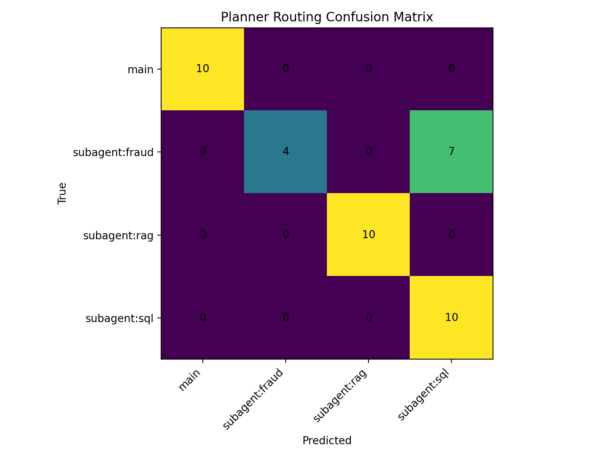

## Router + SQL Module (Reorg Version)

This branch focuses on improving the routing + SQL pipeline for transaction-related queries.

## Key Improvements

- More robust routing from user query → SQL agent
- Improved date parsing (standardized to YYYY-MM-DD)
- Support for both single-day and date-range queries
- Better handling of edge cases and invalid inputs
- Stable error handling (no system crashes)

## Compared to Midterm (router-sql-evaluation)

| Aspect         | Midterm Version | Reorg Version          |
|----------------|-----------------|------------------------|
| Accuracy       | Higher (~0.86)  | Slightly lower (~0.83) |
| Robustness     | Basic           | Improved               |
| Modularity     | Limited         | Improved               |
| Error Handling | Weak            | Stable                 |

Key Trade-off:
Slight drop in accuracy in exchange for better robustness and system reliability.

## Evaluation

### Router (Planner)

- Accuracy: 0.8293
- Macro F1: 0.8185

The routing module correctly handles ~83% of queries with balanced performance across categories.

#### Confusion Matrix

Most predictions fall on the diagonal, indicating correct routing.

However, most errors occur between **fraud and SQL queries**, where fraud-related queries are sometimes misclassified as SQL.

This suggests that routing errors are mainly caused by **semantic ambiguity**, rather than system design issues.

### SQL Agent

- SQL routing rate: 1.00
- Execution success rate: 1.00
- Non-empty answer rate: 1.00
- Error rate: 0.00

The SQL pipeline is highly reliable in both query generation and execution.

## Analysis

We analyzed routing errors and observed that:

- Most errors occur in ambiguous queries
  (e.g., fraud vs transaction queries)

Key insight:
Most errors are caused by semantic ambiguity, not system design flaws.

## Summary

- Improved robustness and modularity
- Reliable SQL execution
- Minor drop in accuracy is acceptable given system improvements

Main challenge remains natural language ambiguity rather than implementation issues.
